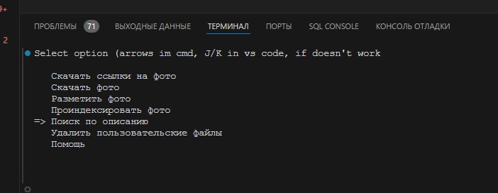
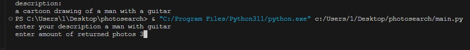
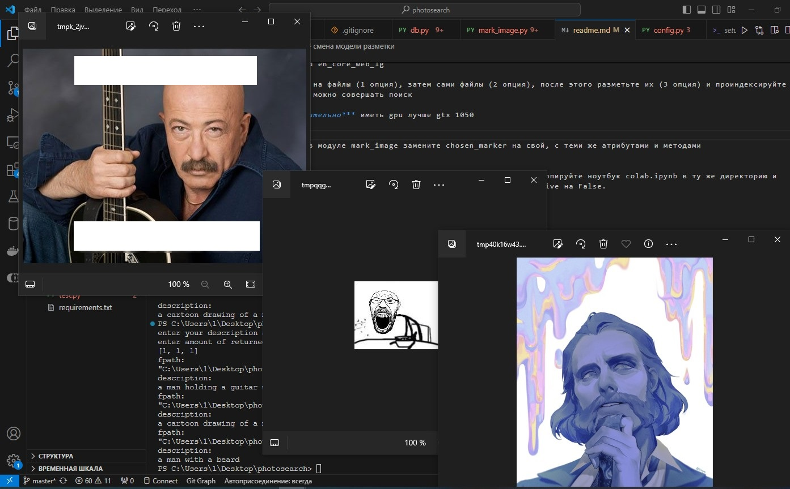
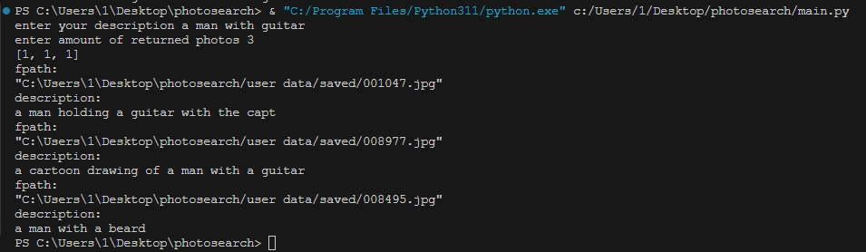

# vk-photosearch
##### для чего нужен этот проект?
я создал этот проект для быстрого поиска по десяткам тысяч фотографий в своём альбоме вк.

как он работает?
он скачивает фотографии из альбома вк (с помощью asyncio, aiohttp), затем размечает их с помощью модели blip (до этого была microsoft/git, но она плохо справлялась), после этого трансформирует данные в вектора bag of words и помещает в хранилище annoy, после чего ищет по минимальному расстоянию до ближайшего вектора

##### стек
aiohttp, asyncio, torch, transformers, request, annoy

# использование
1. перейдите по ссылке https://id.vk.com/auth?return_auth_hash=82588d0edf0a355bcc&redirect_uri=https%3A%2F%2Foauth.vk.com%2Fblank.html&redirect_uri_hash=aa925dbe63505d5be3&force_hash=1&app_id=2685278&response_type=token&code_challenge=&code_challenge_method=&scope=1040183263&state= и скопируйте токен (он между &token= и &expires_in) в config.py
2. установите куду (>12.1)
3. pip install -r requirements.txt
4. python -m spacy download en_core_web_lg
5. pytnon main.py
6. сначала скачайте ссылки на файлы (1 опция), затем сами файлы (2 опция), после этого разметьте их (3 опция) и проиндексируйте (4 опция). только после этого можно совершать поиск

для разметки ***крайне желательно*** иметь gpu лучше gtx 1050

## смена модели разметки
для смены модели разметки в модуле mark_image замените chosen_marker на свой, с теми же атрибутами и методами

# использование в колабе
сохраните репозиторий как архив, загрузите в текущую директорию в колабе, скопируйте ноутбук colab.ipynb в ту же директорию и запустите первую ячейку. затем добавьте в config.py токен и смените interactive на False.

чтобы результат сохранился синхронизируйтесь с гдиском

### пример поиска по моим сохранённым фотографиям

